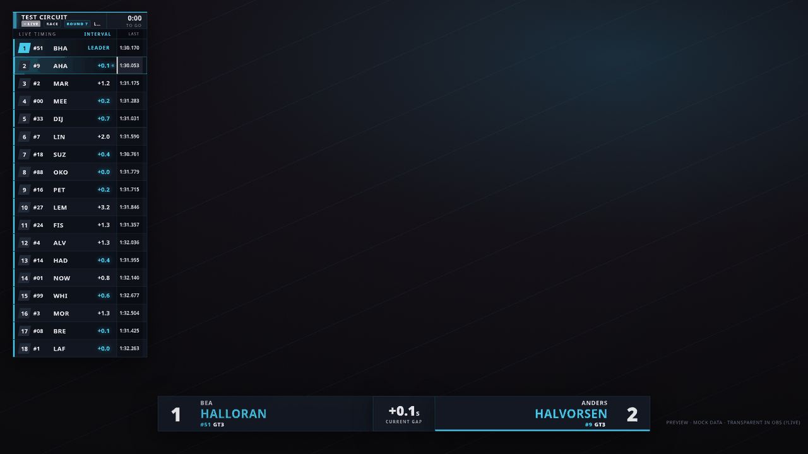
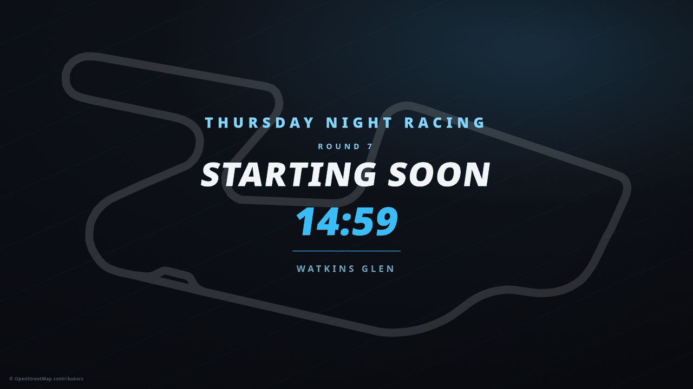
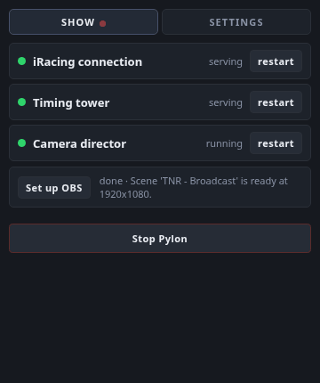
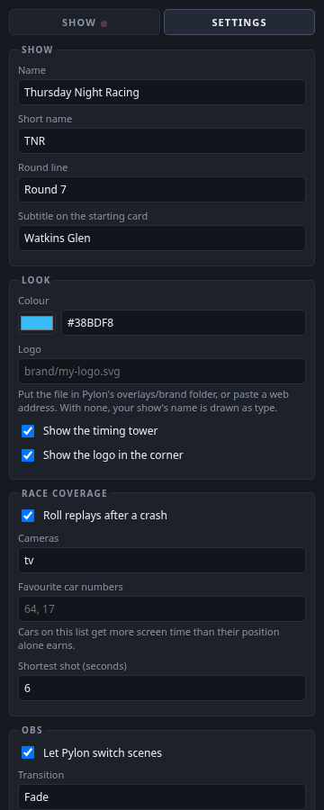

# Pylon

**Pylon broadcasts your iRacing races for you.** It watches the session over
iRacing's telemetry, works out what is worth watching, points the sim's own TV
cameras at it, draws a timing tower over the picture, and switches your OBS
scenes. You start it and stream. Nobody has to sit there driving a camera.

It is not a spotter, an overlay pack or a stream deck plugin. It is the person in
the truck: it decides the shots.

- Follows the leader, cuts to a fight, holds a pit stop, stays with a stricken car
- Rolls an instant replay of a crash off the sim's own tape, then comes home
- F1-style timing tower with live gaps, sectors, flags, pop-ins and fastest laps
- Holding cards before the green, between sessions and after the chequer
- Switches OBS scenes off the session state, so the show runs itself
- Your show's name, your colour, your logo, set in a form inside OBS

No commentary, no voices, no accounts, no cloud. It reads telemetry and talks to
OBS on your own PC, and nothing leaves it.



*The timing tower and a battle pop-in. Every graphic here is transparent over the
sim's own picture in OBS, and the whole thing takes your colour and your name.*



*A holding card before the green, counting down. There is one for the gap between
sessions and one for after the chequer, and Pylon cuts to them on its own.*

---

## Getting started

**You need:** Windows, iRacing, and [OBS](https://obsproject.com/) 28 or newer.

> **There is no installer yet.** Pylon runs from a source checkout today, which
> takes about five minutes and two commands. [Run it from source](#run-it-from-source)
> has the whole thing, then come back here at step 2. When there is a build, step 1
> becomes downloading it.

1. **Install it.** Either [from source](#run-it-from-source) (the only way right
   now) or, once builds exist, from the releases page.

2. **Let Pylon set OBS up**, with **OBS closed**:

   ```
   uv run pylon obs-prepare        # from a source checkout
   Pylon.exe obs-prepare           # from an installed copy (the installer offers this)
   ```

   That switches on OBS's WebSocket server and adds the control panel as a dock.
   Both are edits to OBS's own settings files, which is the only way to do them:
   nothing can talk to OBS until its WebSocket is on. OBS rewrites those files when
   it closes, so it has to be shut; the command checks and tells you if it is not.

   It is additive. An existing password and any docks you already have are kept,
   and running it twice changes nothing.

   *Rather do it yourself?* In OBS: *Tools → WebSocket Server Settings → Enable
   WebSocket server → OK*, then *View → Docks → Custom Browser Docks*, name it
   `Pylon` and paste `http://127.0.0.1:8882/`.

3. **Start Pylon.** From a source checkout that is `uv run pylon studio`; from an
   installed copy it is the desktop shortcut. Either way a console window opens and
   stays open: that is the log, and it is where anything that goes wrong explains
   itself. Leave it running.

4. **Find the Pylon dock in OBS**, under *View → Docks*. Drag it wherever suits
   you. This is where you check on the show and change settings.

   

   Three green lamps means it is working. The dot beside **SHOW** lights when OBS
   starts streaming, so you can see you are live without leaving the panel.

5. **Click "Set up OBS"** in that panel. It builds the scene with your sim capture
   and the timing tower on it, plus three holding cards.

6. **Join a session as a spectator** and watch the panel. When the three lamps are
   green, go to your race scene in OBS and hit Start Streaming.

If something is not right, the panel says so, and the doctor checks everything at
once and tells you the one thing to do next:

```
uv run pylon doctor          # from a source checkout
Pylon.exe doctor             # from an installed copy (also a Start menu shortcut)
```

### Running Pylon beside another broadcaster

Pylon is built so that a second broadcast tool on the same PC cannot be damaged by
it, but the two still cannot be **live at the same time**: only one thing can point
the sim's cameras, and they would fight over the ports.

What Pylon does to stay out of the way:

* **Every scene it makes carries your show's name**, the programme scene included,
  and so does every source inside those scenes. OBS source names must be unique
  across a whole scene collection rather than within one scene, so naming the scenes
  alone is not enough to keep two shows apart. Set a name in Settings before you
  click "Set up OBS" and it will never touch a scene or a source belonging to
  anything else.
* **It leaves OBS's encoder settings alone** unless you ask it to set your stream
  destination too. Those settings live in the OBS profile, outside any one scene
  collection, so writing them uninvited would reach past our own scenes.
* **It only ever reclaims a port from a process that looks like Pylon.** Anything
  else holding one is reported and left running.

If you want belt and braces, give Pylon its own **Scene Collection** in OBS
(*Scene Collection → New*) and switch to it before running the setup. Change the
ports under `[advanced]` in the settings too, and then even starting both by mistake
is harmless.

### Spectate, do not drive

**Pylon moves the cameras of the PC it runs on**, because that is how iRacing's
broadcast controls work. If you run it on the PC you are racing on, it will move
*your* view while you drive.

So: run it on a second PC, or on a second iRacing account spectating the session,
or use it on a saved replay. Watching your own race back with Pylon directing it
works perfectly and is the easiest way to see what it does.

---

## Settings

Everything is in the panel's **Settings** tab, and behind it one commented file
you can open with `pylon config --edit`:




```
%LOCALAPPDATA%\Pylon\config.toml
```

The settings that matter most:

| Setting | What it does |
| --- | --- |
| **Name** | Your show or league, drawn on the holding cards and the corner bug |
| **Round line** | Free text: "Round 4", "Feature Race". Shown as a chip on the tower |
| **Colour** | One colour paints the entire overlay. Everything else is mixed from it |
| **Logo** | A file in Pylon's `overlays/brand` folder, or a web address |
| **Favourite car numbers** | Cars that get more screen time than their position earns |
| **Cameras** | `tv` (trackside), `onboard` (in-car) or `wide` (helicopter and blimp) |
| **Replays** | Roll an instant replay after a crash |

Your settings live outside the program folder, so upgrading Pylon never touches
them.

### Favourites

Set **Favourite car numbers** to `64, 17` and those cars are worth more to the
director than their position alone says: a friend running eleventh gets screen
time instead of never appearing. It is a nudge, not a lock. A fight for the lead
still wins, and a crash always wins, because a director that simply follows one
car is not directing.

---

## What it looks like at a race

Start Pylon before you join. It shows the "Starting Soon" card until cars appear
on the grid, then cuts to the grid forming, then covers the race: the leader, the
fights, the stops, the incidents, the finish one car at a time. When the last car
is home it holds on "Race Complete". You never touch OBS.

The panel's three lamps are the three parts:

| | |
| --- | --- |
| **iRacing connection** | reads the sim's telemetry and sends camera commands |
| **Timing tower** | serves the overlay pages OBS loads |
| **Camera director** | the part that decides the shots |

Any of them can be restarted from the panel without stopping the broadcast.

---

## Questions people ask

**Does this get me banned?** No. It uses iRacing's own published SDK: the same
shared-memory telemetry and broadcast messages that every timing app and spotter
uses. It does not touch the game's memory, its files or anti-cheat.

**Will it work with my league's rules?** It shows what the telemetry shows.
Nothing is sent anywhere and nothing is recorded but your own stream.

**Can I use my own overlay instead?** Yes. Turn off the timing tower in Settings
and keep the camera direction and scene switching.

**Does it work on ovals / multi-class / team races?** Ovals and multi-class both
work and have had less testing than road racing, so if something looks wrong
there, a recording (see below) is the fastest way to get it fixed. Team races with
driver swaps are untested.

**Can I run it on the PC I race on?** Not while you are driving. See above.

**Does it need the internet?** No.

**Why does Windows warn me about it?** Because it is not code-signed. Certificates
cost money every year and this is free software. The source is all here, and the
release is built in public by the GitHub Actions workflow in this repository, so you
can check what went into it.

---

## When something goes wrong

Run `Pylon.exe doctor`. It checks your settings, OBS, the scenes, iRacing and the
ports, and every failure comes with the one next thing to do.

The two most common problems:

* **"cannot reach OBS"**: OBS is closed, or its WebSocket server was never
  switched on (step 2 above).
* **A black video pane in the programme scene**: OBS's game capture has not
  hooked the sim yet. Start iRacing, then click "Set up OBS" again.

Logs are in `%LOCALAPPDATA%\Pylon\logs`. If you open an issue, attach the console
window's text and those logs.

**A telemetry recording is worth a hundred bug reports.** Anything the director
got wrong can be replayed and fixed offline from one:

```
Pylon.exe bridge --sdk --live --record my-race.jsonl.gz
```

---

## Run it from source

This is how you run Pylon today, and it is the same on the PC you broadcast from
and on a machine you only want to poke at it with. Two commands plus a clone.

### 1. Install uv

[uv](https://docs.astral.sh/uv/) fetches the right Python and builds the
environment, so you do not have to install Python yourself or think about
virtualenvs.

**Windows** (PowerShell):

```powershell
winget install --id=astral-sh.uv -e
```

**Linux or macOS**:

```bash
curl -LsSf https://astral.sh/uv/install.sh | sh
```

Close and reopen your terminal afterwards so `uv` is on the PATH.

### 2. Clone and build

```
git clone https://github.com/ulchm/pylon.git
cd pylon
uv sync
```

`uv sync` reads `uv.lock` and makes a `.venv` in the checkout with exactly the
pinned versions. It takes a few seconds and downloads about thirty megabytes.
Nothing is installed system-wide and nothing outside this folder is touched.

Check it worked:

```
uv run pylon doctor
```

That reports on your settings, OBS, the scenes, iRacing and the ports, and every
failure comes with the one next thing to do. On a machine with no OBS running,
one FAIL line about OBS is the expected answer.

### 3. Put it on the Desktop (Windows)

```powershell
powershell -NoProfile -ExecutionPolicy Bypass -File tools\make_shortcut.ps1
```

That makes two shortcuts: **Pylon**, which starts the show, and **Pylon - Check my
setup**, which runs the doctor and holds the window open. Both point into this
checkout, so a `git pull` updates what they launch.

You do not have to: `uv run pylon studio` in the checkout does the same thing.

### 4. Let Pylon set OBS up

With **OBS closed**:

```
uv run pylon obs-prepare
```

Then start OBS, start Pylon, and click **Set up OBS** in the Pylon dock. Step 2
of [Getting started](#getting-started) has the detail.

### Updating

```
git pull
uv sync
```

Your settings live in `%LOCALAPPDATA%\Pylon` (Windows) or `~/.config/pylon`
(Linux), outside the checkout, so pulling never touches them.

### Where things are

| | |
| --- | --- |
| Settings | `%LOCALAPPDATA%\Pylon\config.toml`, or `uv run pylon config --edit` |
| Logs | `%LOCALAPPDATA%\Pylon\logs\` |
| Your logo | drop it in `overlays/brand/` and name it in Settings |

---

## For developers

Development happens on Linux against recordings. The only component that must run
on Windows is the SDK bridge: reading live telemetry is a Windows memory-mapped
file, and camera control is Win32 window messaging. That surface is a single thin
pyirsdk wrapper, unit-tested against a fake, so the whole suite runs on Linux with
no sim and no display.

Windows means a real Windows PC, not Wine or Proton: iRacing's anti-cheat ships no
Linux module, so the sim will not launch under Wine at all, replays included.

```
uv run pytest -q          the suite: 600-odd tests, about a minute
uv run ruff check .       the linter
```

Both are the gate. Run them before you push.

Some of the tests drive a real headless Chrome against the overlay pages, and skip
themselves when there is no Chrome to find. To include them, point at one:

```
PYLON_CHROME=/path/to/chrome uv run pytest -q
```

Offline, against a recording, no sim needed:

```
uv run pylon synth out.jsonl.gz   make a synthetic race to test against
uv run pylon direct FILE          dry-run the director, print the shot list
uv run pylon story FILE           the world model's view: battles, incidents, events
uv run pylon overlay FILE         preview the timing tower in a browser
```

A capture off a real session is worth far more than a synthetic one, and it is how
almost everything in `DESIGN.md` section 14 was found:

```
uv run pylon bridge --sdk --live --record my-race.jsonl.gz
```

### How it fits together

Three processes and OBS. `pylon studio` starts them in order, waits for each to
actually serve before starting the next, and keeps them up.

```
bridge     8779   reads the sim's shared memory; telemetry out, camera commands in
overlay    8778   serves the timing tower (its WebSocket on 8777)
director          the brain: drives the in-sim cameras and cuts OBS scenes
panel      8782   the control panel, docked inside OBS
```

* [`DESIGN.md`](DESIGN.md), the architecture, the director's scoring logic and
  the verified iRacing SDK surface
* [`packaging/README.md`](packaging/README.md), building the Windows release
* `src/pylon/`, where `telemetry/`, `world/`, `director/`, `camera/`, `obs/` and
  `overlay/` are the domains; `show/` runs a broadcast over them; `config.py` is
  the settings file and `settings.py` every port and path, typed once
* `overlays/`, the browser sources OBS loads

Pull requests are welcome. Run `uv run ruff check . && uv run pytest -q` first.

---

## Credits and licence

Pylon is MIT licensed. See [LICENSE](LICENSE).

It is not affiliated with or endorsed by iRacing.com Motorsport Simulations, LLC.
iRacing is their trademark, and Pylon does not ship their logo: the overlay has a
place for it in the corner, and you can drop the official file from their media
kit into `overlays/brand/` if you want it on your stream.

The circuit outlines in `overlays/tracks/` are drawn from OpenStreetMap geometry
and are available under the [Open Database
Licence](https://opendatacommons.org/licenses/odbl/). **Any surface showing one
owes the credit `© OpenStreetMap contributors`**, which the holding cards print
alongside the drawing. If you put one somewhere else, take the credit with it.

The flag glyphs come from a subset of Noto Color Emoji (SIL Open Font License
1.1); see `overlays/brand/LICENSE-Noto`.
